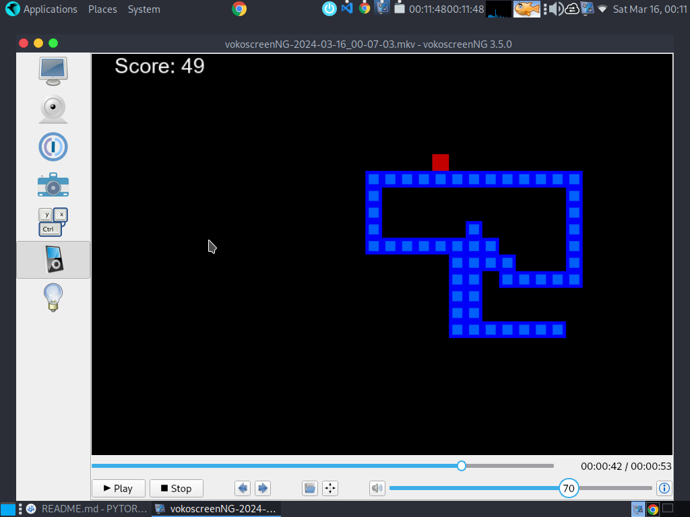

## Deep Q-Network (DQN) Overview

The AI agent in this Snake game utilizes Deep Q-Network (DQN), a reinforcement learning algorithm that combines Q-learning with deep neural networks.

### Key Components of DQN:

- **Q-Learning**: Q-learning is a model-free algorithm used to find an optimal action-selection policy for a given finite Markov decision process (MDP).

- **Deep Q-Networks (DQN)**: DQN enhances Q-learning by using deep neural networks to approximate the Q-values, which represent the expected future rewards for taking a particular action in a specific state.

- **Experience Replay**: DQN employs experience replay, storing past experiences in a buffer and randomly sampling from it during training to stabilize learning and improve sample efficiency.

- **Target Network**: DQN uses a target network with frozen parameters to provide fixed targets for the Q-values during training, further stabilizing the learning process.

- **Exploration vs. Exploitation**: DQN balances exploration (trying new actions) and exploitation (choosing the best-known action) using an ε-greedy strategy.

### Training Process:

During training, the agent interacts with the environment, collects experiences, and updates the Q-values using the loss between predicted and target Q-values. Over time, the agent learns an optimal policy that maximizes cumulative rewards, allowing it to play the game effectively.

1. **Record**: 80.
1. **Mean Score**: 49.

### Problems

One of the main challenges in this implementation is that the snake does not have spatial awareness of its body. Therefore, it can inadvertently collide with itself, leading to premature game over.



## Table of Contents

- [Requirements](#requirements)
- [Installation](#installation)
- [Usage](#usage)
- [Gameplay](#gameplay)
- [Files](#files)
- [Recording Gameplay](#recording-gameplay)
- [Credits](#credits)

## Requirements

- Python 3.x
- Pygame library

## Installation

1. Clone the repository:

    ```bash
    git clone https://github.com/u-mar/Snake-RL.git
    ```

2. Navigate to the project directory:

    ```bash
    cd Snake-RL
   ```


3. Install dependencies:

    ```bash
    pip install -r requirements.txt
   ```


## Usage

Run the game by executing the main script:

    python agent.py
   


## Gameplay

- Control the snake using the arrow keys (Up, Down, Left, Right) to eat food and grow.
- If the snake collides with itself or the boundaries of the window, the game ends.
- Upon game over, a replay button appears, allowing you to start a new game.

## Files

- `agent.py`: Main script to run the game.
- `game.py`: Contains the game logic and main game loop.
- `model.py`: Defines the neural network model for AI-based gameplay.
- `helper.py`: Includes helper functions for plotting and visualization.
- `README.md`: Instructions and information about the game.


## Credits

This game is inspired by the classic Snake game and built using Python and Pygame. Special thanks to the developers of Pygame for providing a powerful framework for game development.

Feel free to customize and expand this README file for your project!
